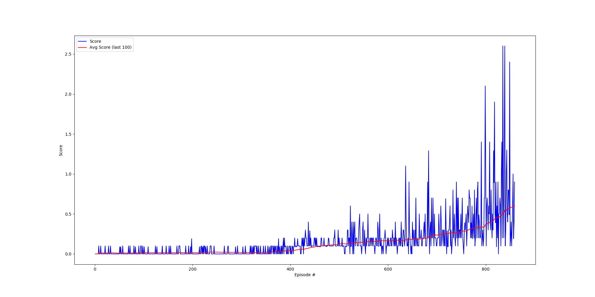
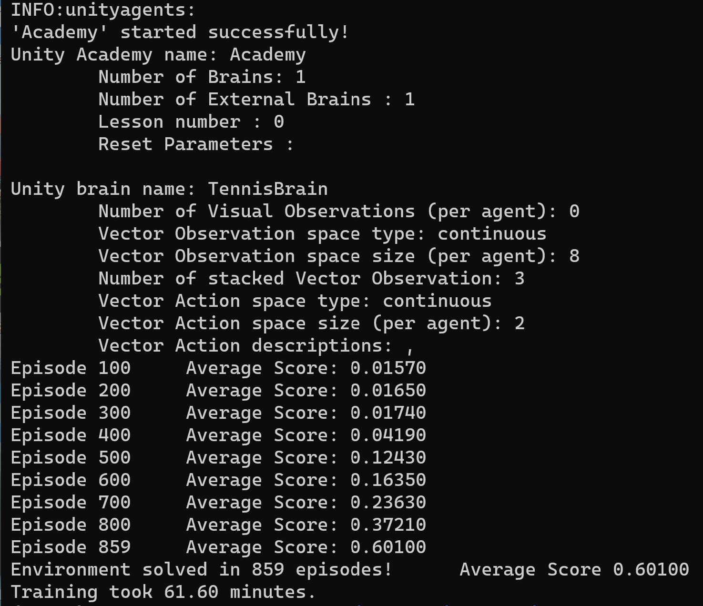

# Project Report

## Learning Algorithm
The implementation of this project is based on the deep deterministic policy gradient (DDPG) algorithm. It's an actor-critic, model-free algorithm based on the deterministic policy gradient algorithm but can operate over continuous action spaces. It's used for each agent but both agent share a replay buffer which is updated by all agents' experiences during training.

### Model Architecture and Training
The actor- and critic networks are both feedforward neural networks consisting of two hidden layers and different numbers of batch normalization layers in-between. The actor network applies batch normalization after each linear layer and the critic network employs only batch normalization after the first linear layer.

Both hidden layers consist of 128 neurons. The actor network's output layer is made up of two neurons (size of the action space) and the critic's output (the Q-value) is provided by one neuron. The hidden layers use the ReLU activation function to produce their outputs. As the action values are between -1 and 1, tanh is used as activation function on the output of the actor network. The critic network feeds the actions (input) not in the first, as it does with the states, but only in the second hidden layer.

Both, the actor and the critic networks consist of a local (regular) and target network. Parameter updates are done by an Adam optimizer. The target network is softly updated with the weights of the local network after every time step. 

Training is started after the replay buffer contains enough samples to deliver at least a full batch of samples and only after 7 time steps were elapsed after the last training cycle to collect further samples. Inside a training cycle learning takes place 10 times before collecting further experiences from the environment. Both hyperparameters (**update_every** and **network update**) can be configured in config.yml.

Decreasing Gaussian noise is added to the actions while training the model to allow exploratory behaviour. As training is very unstable exploration is reduced from epoch to epoch by an additional noise factor. This factor starts with value 1.0 and is decreased by a noise reduction factor of 0.9995 after each epoch until a minimum value of 0.1 is reached, i.e. exploration is still possible in later epochs but only to a limited extend. This was one of the key success factors to get a less volatile training and to exeed the performance threshold of 0.5. Additionally, training became much faster.

### Hyperparameters
For learning the agent the following hyperparameters were used:

* n_episodes: 3000
* max_timesteps: 1000
* buffer_size: 100000
* batch_size: 1024
* update_every: 7
* network_update: 10
* gamma: 0.99
* tau: 1.0E-3
* lr_actor: 1.0E-4
* lr_critic: 1.0E-3
* weight_decay: 0.0
* ou_mu: 0.0
* ou_theta: 0.15
* ou_sigma: 0.19
* noise_start: 1.0
* noise_reduce: 0.9995
* noise_min: 0.1
* scores_window: 100

Details about the meaning of each hyperparameter can be found in the file 
config.yml.

## Plot of Rewards
The following figures show the reward plot, the training output and the 
number of episodes to solve the environment of the final models:

    
    
   
  <em> Reward plot for the training of two agents and the corresponding training output. Environment was solved after 859 episodes with an average score of 0.60100.</em>

## Ideas for Future Work
Further hyperparameter tuning and the implementation of a prioritized experience replay buffer (PER) could help to further improve training and reduce volatility.
Additionally, implementing MADDPG or TD3 as alternative algorithms could be interesting to see whether they can outperform the algorithm implemented in this project.
